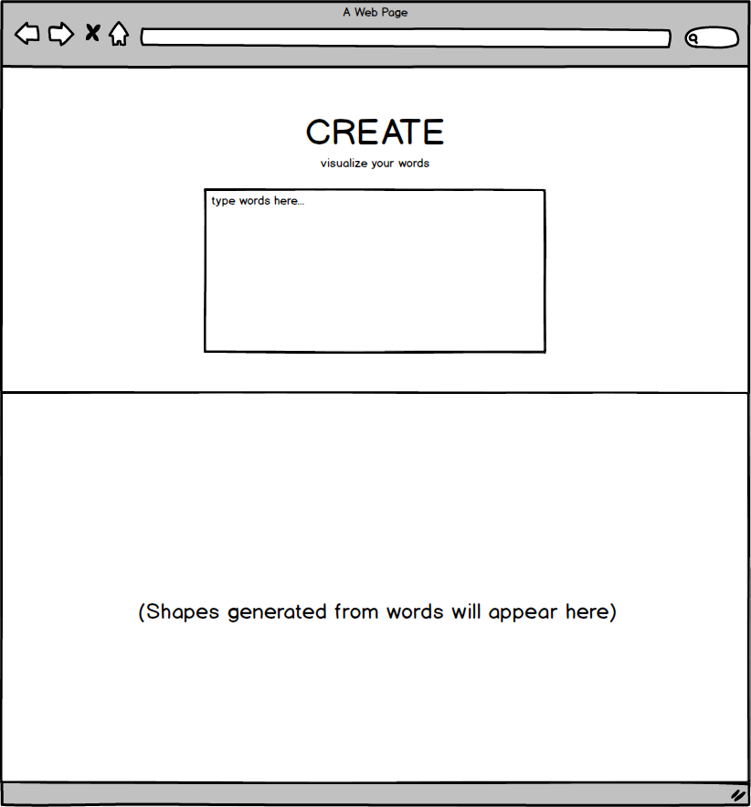

# CREATE

## Background
Synthesia is a perceptual phenonemon where stimulation of one sensory function leads to an involuntary experience of another sensory function. 

CREATE is a virtual canvas that allows users to type words, poems, or stories and see a those words translated into visualization of shapes and colors. 

Certain words or groups of words will trigger a specific shape that's either a circle, a triangle, or square. Each shape will be initialized with a specific opacity, color/gradient, size, and animation based on patterns of the words.

## Functionality and MVP
- [ ] Take user input and parse each word or group of words into a hash-like function
- [ ] Have the output of the function determine which shape and what properties of that shape will have
- [ ] Display the shapes on a canvas

**Extra functionality (bonus):**
 - Gamify the shape creation progress: give the shapes a physical properties of how they move through space on the canvas
 - Have users try to balance stack the shapes so it reaches the top of the canvas
 - Limit of the number of words the user can use to make it to the top of the canvas

## Wireframe
The user will type into a text box and a canvas will sit below it where the shapes will appear.

## Technologies, plugins, and APIs
CREATE will be implemented using vanilla JavaScript, the SVG capabilities in HTML. No jQuery will be used, just vanilla DOM manipulation. 

The app will be broken down into the following scripts/source files:
* `shapes.js`
  * will define three different classes for each shape (circle, square, triangle)
  * when a new instance of each class is called a new SVG element containing the object's properties will be returned
* `conversion.js`
  * parse the user input text through a hashing function to generate properties the shape objects should have
  * the hashing function should return a new shape object
* `canvas.js`
  * responsible for keeping track of all the on a canvas
* `RESPOND.js`
  * entry file
* `util.js`
  * utility code (if necessary)

## Implementation 
**Day 1:**
Set up the skeletons for the files listed above. Configure webpack config file. Start to 

Setup all necessary Node modules, including getting webpack up and running and Easel.js installed. Create webpack.config.js as well as package.json. Write a basic entry file and the bare bones of all 3 scripts outlined above. Learn the basics SVG and DOM manipulation in the evening. Goals for the day:

 * Get a green bundle with webpack
 * Display an SVG on the the screen

**Day 2:** 
Morning: Keep learning SVG properties and experiment rendering different shapes of different opacities, colors, and size onto a canvas.

 * Learn and implement how to make multiple shape objects appear on DOM via click user interaction.
 * Learn and implement event handles to make the shape attributes (opacity, size, color, animation) adjustable.

Find either an API to fetch poems or compile some poems in the public domain into a JavaScript array in the util.js file. 

**Day 3:**
Work on hashing function inside `conversion.js` that takes user text input and parse the words into properties the shape objects will have. 

**Day 4:**
Implement extra functionality if on schedule. Otherwise keep working on core functionality and fixing any bugs. 

