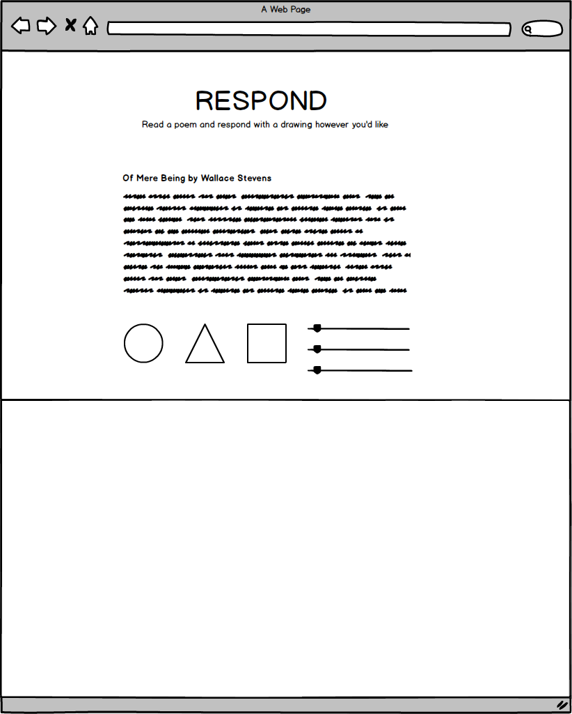

# RESPOND

## Background
Sometimes seeing art inspires art. Often times museum visitors will visit an exhibit and feel inspired by what they see. Seldom can they respond and create something immediately based on the art they're viewing. 

RESPOND is a virtual canvas that allows users to create art based on a poem they read. Users are intentionally constrained to drawing on the canvas using only three shapes: a circle, a triangle, and square. These shapes will be initialized with a random opacity, color/gradient, size, and animation but will be adjustable later with user input. 

## Functionality and MVP
- [ ] Display a random poem generated either via fetch request to an existing poem API or poems stored in an array. 
- [ ] Display three template SVG shapes (a circle, triangle, and square) 
- [ ] Drag and drop multiple SVG shapes from the template SVG shapes onto a canvas
- [ ] Modify properties of the SVG objects (color, opacity, size, animation)

**Extra functionality (bonus):**
 - modify the SVG objects via a modal popup window
 - be able to change the number of vertices on a shape
 - allow users to draw on the canvas first before dragging and dropping shapes 

## Wireframe
The generated poem will centered on the page with the three template shapes below it. The canvas which users can drag and drop from the three template shapes will sit on the bottom of the page (below the template shapes).

## Technologies, plugins, and APIs
RESPOND will be implemented using vanilla JavaScript, the SVG capabilities in HTML. No jQuery will be used, just vanilla DOM manipulation. If there's time to implement drawing on a canvas, Canvas will also be used for that feature.

The app will be broken down into the following scripts/source files:
* `shapes.js`
  * contains the logic of generating the SVG template shape objects with random opacity, color, shape, and animation
* `interactivity.js`
  * contains the logic allowing users to manipulate the shapes' opacity, color, and animation
* `canvas.js`
  * responsible for keeping track of all the shapes and their properties on a canvas
* `RESPOND.js`
  * entry file
* `util.js`
  * utility code (if necessary)

## Implementation 
**Day 1:**
Set up the skeletons for the files listed above. Configure webpack config file. Start to learn SVG and DOM manipulation in the evening. 

**Day 2:** 
Morning: Keep learning SVG properties and experiment rendering different shapes of different opacities, colors, and size onto a canvas.

 * Learn and implement how to make multiple shape objects appear on DOM via click user interaction.
 * Learn and implement event handlers to make the shape objects drag and drop.
 * Learn and implement event handles to make the shape attributes (opacity, size, color, animation) adjustable.

Find either an API to fetch poems or compile some poems in the public domain into a JavaScript array in the util.js file. 

**Day 3:**
Install controlls and customization logic for the user. Style and polishing.

**Day 4:**
Implement extra functionality if on schedule. Otherwise keep working on core functionality and fixing any bugs. 

